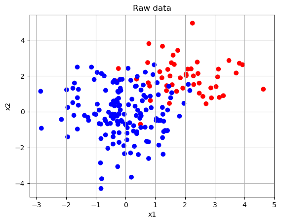
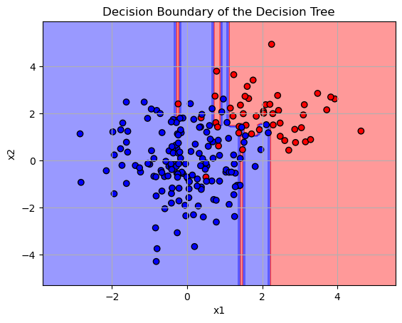
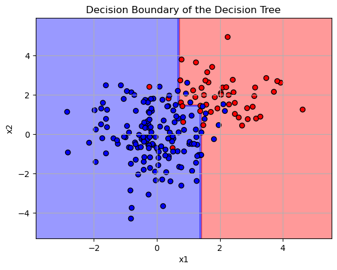
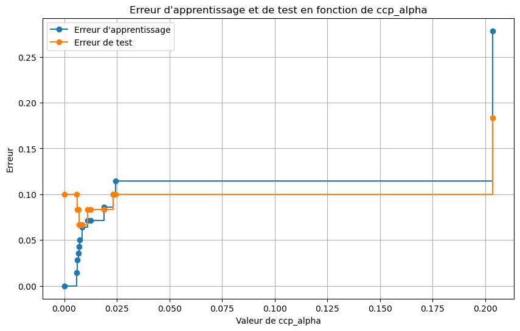
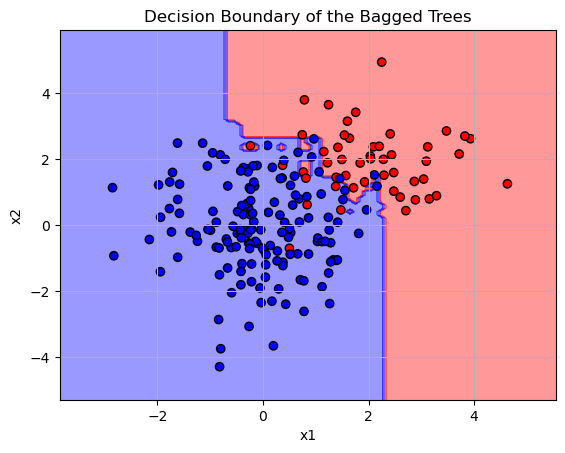
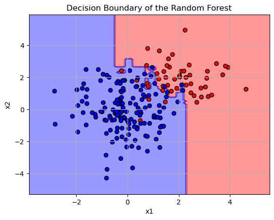

# Tree, bagging et forêts aléatoires

## Simulation

Soit X un vecteur gaussien de loi $\mathcal N_p(\boldsymbol \mu, \boldsymbol \Sigma)$


```python
import random as rd
from scipy.stats import multivariate_normal
import numpy as np
import matplotlib.pyplot as plt
from matplotlib.colors import ListedColormap
import math

NG1, NG2 = 50, 150
mu1 = [2, 2]  # Moyenne G1
cov1 = [[1, 0], [0, 1]]  # Matrice de covariance G1 (indépendance)
    
mu2 = [0, 0]  # Moyenne G2
cov2 = [[1, 0], [0, 2]]  # Matrice de covariance G2 (indépendance mais variance différente)
    
# Génération des données
xG1 = multivariate_normal(mean=mu1, cov=cov1).rvs(NG1)
xG2 = multivariate_normal(mean=mu2, cov=cov2).rvs(NG2)
    
X = np.concatenate((xG1, xG2), axis=0)
Y = [0] * NG1 + [1] * NG2


# Visualisation des données générées
mycolormap = ListedColormap(['#FF0000', '#0000FF'])
plt.scatter(X[:, 0], X[:, 1], c=Y, cmap=mycolormap)
plt.title('Raw data')
plt.grid()
plt.xlabel('x1')
plt.ylabel('x2')
plt.show()
```


    

    


## Classification avec arbre de décision


```python
from sklearn.tree import DecisionTreeClassifier
from sklearn.metrics import accuracy_score

# Initialiser le classificateur
dt_classifier = DecisionTreeClassifier()

# Entraîner le modèle
dt_classifier.fit(X, Y)

# Prédire les probabilités sur le jeu d'entraînement
pred_proba_train = dt_classifier.predict_proba(X)

# Obtenir les prédictions des classes
pred_class_train = np.argmax(pred_proba_train, axis=1)

# Calculer l'accuracy sur le jeu d'entraînement
train_accuracy = accuracy_score(Y, pred_class_train)

# Afficher l'erreur d'entraînement
train_error = 1 - train_accuracy
print(f"Erreur sur l'ensemble d'entraînement : {train_error:.2f}")

```

    Erreur sur l'ensemble d'entraînement : 0.00


### Tracé de la frontière de décision avec contourf


```python
# ---- Traçage de la frontière de décision ----
# Créer une grille de points couvrant l'espace des données
x_min, x_max = X[:, 0].min() - 1, X[:, 0].max() + 1
y_min, y_max = X[:, 1].min() - 1, X[:, 1].max() + 1
xx, yy = np.meshgrid(np.arange(x_min, x_max, 0.1),
                     np.arange(y_min, y_max, 0.1))

# Prédire la classe pour chaque point de la grille
Z = dt_classifier.predict(np.c_[xx.ravel(), yy.ravel()])
Z = Z.reshape(xx.shape)

# Tracer la frontière de décision avec contourf
plt.contourf(xx, yy, Z, alpha=0.4, cmap=mycolormap)

# Tracer les points de données
plt.scatter(X[:, 0], X[:, 1], c=Y, edgecolors='k', cmap=mycolormap)
plt.title('Decision Boundary of the Decision Tree')
plt.grid()
plt.xlabel('x1')
plt.ylabel('x2')
plt.show()
```


    

    


```python
help(DecisionTreeClassifier)
```

    Help on class DecisionTreeClassifier in module sklearn.tree._classes:
    
    class DecisionTreeClassifier(sklearn.base.ClassifierMixin, BaseDecisionTree)
     |  DecisionTreeClassifier(*, criterion='gini', splitter='best', max_depth=None, min_samples_split=2, min_samples_leaf=1, min_weight_fraction_leaf=0.0, max_features=None, random_state=None, max_leaf_nodes=None, min_impurity_decrease=0.0, class_weight=None, ccp_alpha=0.0, monotonic_cst=None)
     |
     |  A decision tree classifier.
     |
     |  Read more in the :ref:`User Guide <tree>`.
     |
     |  Parameters
     |  ----------
     |  criterion : {"gini", "entropy", "log_loss"}, default="gini"
     |      The function to measure the quality of a split. Supported criteria are
     |      "gini" for the Gini impurity and "log_loss" and "entropy" both for the
     |      Shannon information gain, see :ref:`tree_mathematical_formulation`.
     |
     |  splitter : {"best", "random"}, default="best"
     |      The strategy used to choose the split at each node. Supported
     |      strategies are "best" to choose the best split and "random" to choose
     |      the best random split.
     |
     |  max_depth : int, default=None
     |      The maximum depth of the tree. If None, then nodes are expanded until
     |      all leaves are pure or until all leaves contain less than
     |      min_samples_split samples.
     |
     |  min_samples_split : int or float, default=2
     |      The minimum number of samples required to split an internal node:
     |
     |      - If int, then consider `min_samples_split` as the minimum number.
     |      - If float, then `min_samples_split` is a fraction and
     |        `ceil(min_samples_split * n_samples)` are the minimum
     |        number of samples for each split.
     |
     |      .. versionchanged:: 0.18
     |         Added float values for fractions.
     |
     |  min_samples_leaf : int or float, default=1
     |      The minimum number of samples required to be at a leaf node.
     |      A split point at any depth will only be considered if it leaves at
     |      least ``min_samples_leaf`` training samples in each of the left and
     |      right branches.  This may have the effect of smoothing the model,
     |      especially in regression.
     |
     |      - If int, then consider `min_samples_leaf` as the minimum number.
     |      - If float, then `min_samples_leaf` is a fraction and
     |        `ceil(min_samples_leaf * n_samples)` are the minimum
     |        number of samples for each node.
     |
     |      .. versionchanged:: 0.18
     |         Added float values for fractions.
     |
     |  min_weight_fraction_leaf : float, default=0.0
     |      The minimum weighted fraction of the sum total of weights (of all
     |      the input samples) required to be at a leaf node. Samples have
     |      equal weight when sample_weight is not provided.
     |
     |  max_features : int, float or {"sqrt", "log2"}, default=None
     |      The number of features to consider when looking for the best split:
     |
     |          - If int, then consider `max_features` features at each split.
     |          - If float, then `max_features` is a fraction and
     |            `max(1, int(max_features * n_features_in_))` features are considered at
     |            each split.
     |          - If "sqrt", then `max_features=sqrt(n_features)`.
     |          - If "log2", then `max_features=log2(n_features)`.
     |          - If None, then `max_features=n_features`.
     |
     |      Note: the search for a split does not stop until at least one
     |      valid partition of the node samples is found, even if it requires to
     |      effectively inspect more than ``max_features`` features.
     |
     |  random_state : int, RandomState instance or None, default=None
     |      Controls the randomness of the estimator. The features are always
     |      randomly permuted at each split, even if ``splitter`` is set to
     |      ``"best"``. When ``max_features < n_features``, the algorithm will
     |      select ``max_features`` at random at each split before finding the best
     |      split among them. But the best found split may vary across different
     |      runs, even if ``max_features=n_features``. That is the case, if the
     |      improvement of the criterion is identical for several splits and one
     |      split has to be selected at random. To obtain a deterministic behaviour
     |      during fitting, ``random_state`` has to be fixed to an integer.
     |      See :term:`Glossary <random_state>` for details.
     |
     |  max_leaf_nodes : int, default=None
     |      Grow a tree with ``max_leaf_nodes`` in best-first fashion.
     |      Best nodes are defined as relative reduction in impurity.
     |      If None then unlimited number of leaf nodes.
     |
     |  min_impurity_decrease : float, default=0.0
     |      A node will be split if this split induces a decrease of the impurity
     |      greater than or equal to this value.
     |
     |      The weighted impurity decrease equation is the following::
     |
     |          N_t / N * (impurity - N_t_R / N_t * right_impurity
     |                              - N_t_L / N_t * left_impurity)
     |
     |      where ``N`` is the total number of samples, ``N_t`` is the number of
     |      samples at the current node, ``N_t_L`` is the number of samples in the
     |      left child, and ``N_t_R`` is the number of samples in the right child.
     |
     |      ``N``, ``N_t``, ``N_t_R`` and ``N_t_L`` all refer to the weighted sum,
     |      if ``sample_weight`` is passed.
     |
     |      .. versionadded:: 0.19
     |
     |  class_weight : dict, list of dict or "balanced", default=None
     |      Weights associated with classes in the form ``{class_label: weight}``.
     |      If None, all classes are supposed to have weight one. For
     |      multi-output problems, a list of dicts can be provided in the same
     |      order as the columns of y.
     |
     |      Note that for multioutput (including multilabel) weights should be
     |      defined for each class of every column in its own dict. For example,
     |      for four-class multilabel classification weights should be
     |      [{0: 1, 1: 1}, {0: 1, 1: 5}, {0: 1, 1: 1}, {0: 1, 1: 1}] instead of
     |      [{1:1}, {2:5}, {3:1}, {4:1}].
     |
     |      The "balanced" mode uses the values of y to automatically adjust
     |      weights inversely proportional to class frequencies in the input data
     |      as ``n_samples / (n_classes * np.bincount(y))``
     |
     |      For multi-output, the weights of each column of y will be multiplied.
     |
     |      Note that these weights will be multiplied with sample_weight (passed
     |      through the fit method) if sample_weight is specified.
     |
     |  ccp_alpha : non-negative float, default=0.0
     |      Complexity parameter used for Minimal Cost-Complexity Pruning. The
     |      subtree with the largest cost complexity that is smaller than
     |      ``ccp_alpha`` will be chosen. By default, no pruning is performed. See
     |      :ref:`minimal_cost_complexity_pruning` for details.
     |
     |      .. versionadded:: 0.22
     |
     |  monotonic_cst : array-like of int of shape (n_features), default=None
     |      Indicates the monotonicity constraint to enforce on each feature.
     |        - 1: monotonic increase
     |        - 0: no constraint
     |        - -1: monotonic decrease
     |
     |      If monotonic_cst is None, no constraints are applied.
     |
     |      Monotonicity constraints are not supported for:
     |        - multiclass classifications (i.e. when `n_classes > 2`),
     |        - multioutput classifications (i.e. when `n_outputs_ > 1`),
     |        - classifications trained on data with missing values.
     |
     |      The constraints hold over the probability of the positive class.
     |
     |      Read more in the :ref:`User Guide <monotonic_cst_gbdt>`.
     |
     |      .. versionadded:: 1.4
     |
     |  Attributes
     |  ----------
     |  classes_ : ndarray of shape (n_classes,) or list of ndarray
     |      The classes labels (single output problem),
     |      or a list of arrays of class labels (multi-output problem).
     |
     |  feature_importances_ : ndarray of shape (n_features,)
     |      The impurity-based feature importances.
     |      The higher, the more important the feature.
     |      The importance of a feature is computed as the (normalized)
     |      total reduction of the criterion brought by that feature.  It is also
     |      known as the Gini importance [4]_.
     |
     |      Warning: impurity-based feature importances can be misleading for
     |      high cardinality features (many unique values). See
     |      :func:`sklearn.inspection.permutation_importance` as an alternative.
     |
     |  max_features_ : int
     |      The inferred value of max_features.
     |
     |  n_classes_ : int or list of int
     |      The number of classes (for single output problems),
     |      or a list containing the number of classes for each
     |      output (for multi-output problems).
     |
     |  n_features_in_ : int
     |      Number of features seen during :term:`fit`.
     |
     |      .. versionadded:: 0.24
     |
     |  feature_names_in_ : ndarray of shape (`n_features_in_`,)
     |      Names of features seen during :term:`fit`. Defined only when `X`
     |      has feature names that are all strings.
     |
     |      .. versionadded:: 1.0
     |
     |  n_outputs_ : int
     |      The number of outputs when ``fit`` is performed.
     |
     |  tree_ : Tree instance
     |      The underlying Tree object. Please refer to
     |      ``help(sklearn.tree._tree.Tree)`` for attributes of Tree object and
     |      :ref:`sphx_glr_auto_examples_tree_plot_unveil_tree_structure.py`
     |      for basic usage of these attributes.
     |
     |  See Also
     |  --------
     |  DecisionTreeRegressor : A decision tree regressor.
     |
     |  Notes
     |  -----
     |  The default values for the parameters controlling the size of the trees
     |  (e.g. ``max_depth``, ``min_samples_leaf``, etc.) lead to fully grown and
     |  unpruned trees which can potentially be very large on some data sets. To
     |  reduce memory consumption, the complexity and size of the trees should be
     |  controlled by setting those parameter values.
     |
     |  The :meth:`predict` method operates using the :func:`numpy.argmax`
     |  function on the outputs of :meth:`predict_proba`. This means that in
     |  case the highest predicted probabilities are tied, the classifier will
     |  predict the tied class with the lowest index in :term:`classes_`.
     |
     |  References
     |  ----------
     |
     |  .. [1] https://en.wikipedia.org/wiki/Decision_tree_learning
     |
     |  .. [2] L. Breiman, J. Friedman, R. Olshen, and C. Stone, "Classification
     |         and Regression Trees", Wadsworth, Belmont, CA, 1984.
     |
     |  .. [3] T. Hastie, R. Tibshirani and J. Friedman. "Elements of Statistical
     |         Learning", Springer, 2009.
     |
     |  .. [4] L. Breiman, and A. Cutler, "Random Forests",
     |         https://www.stat.berkeley.edu/~breiman/RandomForests/cc_home.htm
     |
     |  Examples
     |  --------
     |  >>> from sklearn.datasets import load_iris
     |  >>> from sklearn.model_selection import cross_val_score
     |  >>> from sklearn.tree import DecisionTreeClassifier
     |  >>> clf = DecisionTreeClassifier(random_state=0)
     |  >>> iris = load_iris()
     |  >>> cross_val_score(clf, iris.data, iris.target, cv=10)
     |  ...                             # doctest: +SKIP
     |  ...
     |  array([ 1.     ,  0.93...,  0.86...,  0.93...,  0.93...,
     |          0.93...,  0.93...,  1.     ,  0.93...,  1.      ])
     |
     |  Method resolution order:
     |      DecisionTreeClassifier
     |      sklearn.base.ClassifierMixin
     |      BaseDecisionTree
     |      sklearn.base.MultiOutputMixin
     |      sklearn.base.BaseEstimator
     |      sklearn.utils._estimator_html_repr._HTMLDocumentationLinkMixin
     |      sklearn.utils._metadata_requests._MetadataRequester
     |      builtins.object
     |
     |  Methods defined here:
     |
     |  __init__(self, *, criterion='gini', splitter='best', max_depth=None, min_samples_split=2, min_samples_leaf=1, min_weight_fraction_leaf=0.0, max_features=None, random_state=None, max_leaf_nodes=None, min_impurity_decrease=0.0, class_weight=None, ccp_alpha=0.0, monotonic_cst=None)
     |      Initialize self.  See help(type(self)) for accurate signature.
     |
     |  fit(self, X, y, sample_weight=None, check_input=True)
     |      Build a decision tree classifier from the training set (X, y).
     |
     |      Parameters
     |      ----------
     |      X : {array-like, sparse matrix} of shape (n_samples, n_features)
     |          The training input samples. Internally, it will be converted to
     |          ``dtype=np.float32`` and if a sparse matrix is provided
     |          to a sparse ``csc_matrix``.
     |
     |      y : array-like of shape (n_samples,) or (n_samples, n_outputs)
     |          The target values (class labels) as integers or strings.
     |
     |      sample_weight : array-like of shape (n_samples,), default=None
     |          Sample weights. If None, then samples are equally weighted. Splits
     |          that would create child nodes with net zero or negative weight are
     |          ignored while searching for a split in each node. Splits are also
     |          ignored if they would result in any single class carrying a
     |          negative weight in either child node.
     |
     |      check_input : bool, default=True
     |          Allow to bypass several input checking.
     |          Don't use this parameter unless you know what you're doing.
     |
     |      Returns
     |      -------
     |      self : DecisionTreeClassifier
     |          Fitted estimator.
     |
     |  predict_log_proba(self, X)
     |      Predict class log-probabilities of the input samples X.
     |
     |      Parameters
     |      ----------
     |      X : {array-like, sparse matrix} of shape (n_samples, n_features)
     |          The input samples. Internally, it will be converted to
     |          ``dtype=np.float32`` and if a sparse matrix is provided
     |          to a sparse ``csr_matrix``.
     |
     |      Returns
     |      -------
     |      proba : ndarray of shape (n_samples, n_classes) or list of n_outputs             such arrays if n_outputs > 1
     |          The class log-probabilities of the input samples. The order of the
     |          classes corresponds to that in the attribute :term:`classes_`.
     |
     |  predict_proba(self, X, check_input=True)
     |      Predict class probabilities of the input samples X.
     |
     |      The predicted class probability is the fraction of samples of the same
     |      class in a leaf.
     |
     |      Parameters
     |      ----------
     |      X : {array-like, sparse matrix} of shape (n_samples, n_features)
     |          The input samples. Internally, it will be converted to
     |          ``dtype=np.float32`` and if a sparse matrix is provided
     |          to a sparse ``csr_matrix``.
     |
     |      check_input : bool, default=True
     |          Allow to bypass several input checking.
     |          Don't use this parameter unless you know what you're doing.
     |
     |      Returns
     |      -------
     |      proba : ndarray of shape (n_samples, n_classes) or list of n_outputs             such arrays if n_outputs > 1
     |          The class probabilities of the input samples. The order of the
     |          classes corresponds to that in the attribute :term:`classes_`.
     |
     |  set_fit_request(self: sklearn.tree._classes.DecisionTreeClassifier, *, check_input: Union[bool, NoneType, str] = '$UNCHANGED$', sample_weight: Union[bool, NoneType, str] = '$UNCHANGED$') -> sklearn.tree._classes.DecisionTreeClassifier
     |      Request metadata passed to the ``fit`` method.
     |
     |      Note that this method is only relevant if
     |      ``enable_metadata_routing=True`` (see :func:`sklearn.set_config`).
     |      Please see :ref:`User Guide <metadata_routing>` on how the routing
     |      mechanism works.
     |
     |      The options for each parameter are:
     |
     |      - ``True``: metadata is requested, and passed to ``fit`` if provided. The request is ignored if metadata is not provided.
     |
     |      - ``False``: metadata is not requested and the meta-estimator will not pass it to ``fit``.
     |
     |      - ``None``: metadata is not requested, and the meta-estimator will raise an error if the user provides it.
     |
     |      - ``str``: metadata should be passed to the meta-estimator with this given alias instead of the original name.
     |
     |      The default (``sklearn.utils.metadata_routing.UNCHANGED``) retains the
     |      existing request. This allows you to change the request for some
     |      parameters and not others.
     |
     |      .. versionadded:: 1.3
     |
     |      .. note::
     |          This method is only relevant if this estimator is used as a
     |          sub-estimator of a meta-estimator, e.g. used inside a
     |          :class:`~sklearn.pipeline.Pipeline`. Otherwise it has no effect.
     |
     |      Parameters
     |      ----------
     |      check_input : str, True, False, or None,                     default=sklearn.utils.metadata_routing.UNCHANGED
     |          Metadata routing for ``check_input`` parameter in ``fit``.
     |
     |      sample_weight : str, True, False, or None,                     default=sklearn.utils.metadata_routing.UNCHANGED
     |          Metadata routing for ``sample_weight`` parameter in ``fit``.
     |
     |      Returns
     |      -------
     |      self : object
     |          The updated object.
     |
     |  set_predict_proba_request(self: sklearn.tree._classes.DecisionTreeClassifier, *, check_input: Union[bool, NoneType, str] = '$UNCHANGED$') -> sklearn.tree._classes.DecisionTreeClassifier
     |      Request metadata passed to the ``predict_proba`` method.
     |
     |      Note that this method is only relevant if
     |      ``enable_metadata_routing=True`` (see :func:`sklearn.set_config`).
     |      Please see :ref:`User Guide <metadata_routing>` on how the routing
     |      mechanism works.
     |
     |      The options for each parameter are:
     |
     |      - ``True``: metadata is requested, and passed to ``predict_proba`` if provided. The request is ignored if metadata is not provided.
     |
     |      - ``False``: metadata is not requested and the meta-estimator will not pass it to ``predict_proba``.
     |
     |      - ``None``: metadata is not requested, and the meta-estimator will raise an error if the user provides it.
     |
     |      - ``str``: metadata should be passed to the meta-estimator with this given alias instead of the original name.
     |
     |      The default (``sklearn.utils.metadata_routing.UNCHANGED``) retains the
     |      existing request. This allows you to change the request for some
     |      parameters and not others.
     |
     |      .. versionadded:: 1.3
     |
     |      .. note::
     |          This method is only relevant if this estimator is used as a
     |          sub-estimator of a meta-estimator, e.g. used inside a
     |          :class:`~sklearn.pipeline.Pipeline`. Otherwise it has no effect.
     |
     |      Parameters
     |      ----------
     |      check_input : str, True, False, or None,                     default=sklearn.utils.metadata_routing.UNCHANGED
     |          Metadata routing for ``check_input`` parameter in ``predict_proba``.
     |
     |      Returns
     |      -------
     |      self : object
     |          The updated object.
     |
     |  set_predict_request(self: sklearn.tree._classes.DecisionTreeClassifier, *, check_input: Union[bool, NoneType, str] = '$UNCHANGED$') -> sklearn.tree._classes.DecisionTreeClassifier
     |      Request metadata passed to the ``predict`` method.
     |
     |      Note that this method is only relevant if
     |      ``enable_metadata_routing=True`` (see :func:`sklearn.set_config`).
     |      Please see :ref:`User Guide <metadata_routing>` on how the routing
     |      mechanism works.
     |
     |      The options for each parameter are:
     |
     |      - ``True``: metadata is requested, and passed to ``predict`` if provided. The request is ignored if metadata is not provided.
     |
     |      - ``False``: metadata is not requested and the meta-estimator will not pass it to ``predict``.
     |
     |      - ``None``: metadata is not requested, and the meta-estimator will raise an error if the user provides it.
     |
     |      - ``str``: metadata should be passed to the meta-estimator with this given alias instead of the original name.
     |
     |      The default (``sklearn.utils.metadata_routing.UNCHANGED``) retains the
     |      existing request. This allows you to change the request for some
     |      parameters and not others.
     |
     |      .. versionadded:: 1.3
     |
     |      .. note::
     |          This method is only relevant if this estimator is used as a
     |          sub-estimator of a meta-estimator, e.g. used inside a
     |          :class:`~sklearn.pipeline.Pipeline`. Otherwise it has no effect.
     |
     |      Parameters
     |      ----------
     |      check_input : str, True, False, or None,                     default=sklearn.utils.metadata_routing.UNCHANGED
     |          Metadata routing for ``check_input`` parameter in ``predict``.
     |
     |      Returns
     |      -------
     |      self : object
     |          The updated object.
     |
     |  set_score_request(self: sklearn.tree._classes.DecisionTreeClassifier, *, sample_weight: Union[bool, NoneType, str] = '$UNCHANGED$') -> sklearn.tree._classes.DecisionTreeClassifier
     |      Request metadata passed to the ``score`` method.
     |
     |      Note that this method is only relevant if
     |      ``enable_metadata_routing=True`` (see :func:`sklearn.set_config`).
     |      Please see :ref:`User Guide <metadata_routing>` on how the routing
     |      mechanism works.
     |
     |      The options for each parameter are:
     |
     |      - ``True``: metadata is requested, and passed to ``score`` if provided. The request is ignored if metadata is not provided.
     |
     |      - ``False``: metadata is not requested and the meta-estimator will not pass it to ``score``.
     |
     |      - ``None``: metadata is not requested, and the meta-estimator will raise an error if the user provides it.
     |
     |      - ``str``: metadata should be passed to the meta-estimator with this given alias instead of the original name.
     |
     |      The default (``sklearn.utils.metadata_routing.UNCHANGED``) retains the
     |      existing request. This allows you to change the request for some
     |      parameters and not others.
     |
     |      .. versionadded:: 1.3
     |
     |      .. note::
     |          This method is only relevant if this estimator is used as a
     |          sub-estimator of a meta-estimator, e.g. used inside a
     |          :class:`~sklearn.pipeline.Pipeline`. Otherwise it has no effect.
     |
     |      Parameters
     |      ----------
     |      sample_weight : str, True, False, or None,                     default=sklearn.utils.metadata_routing.UNCHANGED
     |          Metadata routing for ``sample_weight`` parameter in ``score``.
     |
     |      Returns
     |      -------
     |      self : object
     |          The updated object.
     |
     |  ----------------------------------------------------------------------
     |  Data and other attributes defined here:
     |
     |  __abstractmethods__ = frozenset()
     |
     |  __annotations__ = {'_parameter_constraints': <class 'dict'>}
     |
     |  ----------------------------------------------------------------------
     |  Methods inherited from sklearn.base.ClassifierMixin:
     |
     |  score(self, X, y, sample_weight=None)
     |      Return the mean accuracy on the given test data and labels.
     |
     |      In multi-label classification, this is the subset accuracy
     |      which is a harsh metric since you require for each sample that
     |      each label set be correctly predicted.
     |
     |      Parameters
     |      ----------
     |      X : array-like of shape (n_samples, n_features)
     |          Test samples.
     |
     |      y : array-like of shape (n_samples,) or (n_samples, n_outputs)
     |          True labels for `X`.
     |
     |      sample_weight : array-like of shape (n_samples,), default=None
     |          Sample weights.
     |
     |      Returns
     |      -------
     |      score : float
     |          Mean accuracy of ``self.predict(X)`` w.r.t. `y`.
     |
     |  ----------------------------------------------------------------------
     |  Data descriptors inherited from sklearn.base.ClassifierMixin:
     |
     |  __dict__
     |      dictionary for instance variables
     |
     |  __weakref__
     |      list of weak references to the object
     |
     |  ----------------------------------------------------------------------
     |  Methods inherited from BaseDecisionTree:
     |
     |  apply(self, X, check_input=True)
     |      Return the index of the leaf that each sample is predicted as.
     |
     |      .. versionadded:: 0.17
     |
     |      Parameters
     |      ----------
     |      X : {array-like, sparse matrix} of shape (n_samples, n_features)
     |          The input samples. Internally, it will be converted to
     |          ``dtype=np.float32`` and if a sparse matrix is provided
     |          to a sparse ``csr_matrix``.
     |
     |      check_input : bool, default=True
     |          Allow to bypass several input checking.
     |          Don't use this parameter unless you know what you're doing.
     |
     |      Returns
     |      -------
     |      X_leaves : array-like of shape (n_samples,)
     |          For each datapoint x in X, return the index of the leaf x
     |          ends up in. Leaves are numbered within
     |          ``[0; self.tree_.node_count)``, possibly with gaps in the
     |          numbering.
     |
     |  cost_complexity_pruning_path(self, X, y, sample_weight=None)
     |      Compute the pruning path during Minimal Cost-Complexity Pruning.
     |
     |      See :ref:`minimal_cost_complexity_pruning` for details on the pruning
     |      process.
     |
     |      Parameters
     |      ----------
     |      X : {array-like, sparse matrix} of shape (n_samples, n_features)
     |          The training input samples. Internally, it will be converted to
     |          ``dtype=np.float32`` and if a sparse matrix is provided
     |          to a sparse ``csc_matrix``.
     |
     |      y : array-like of shape (n_samples,) or (n_samples, n_outputs)
     |          The target values (class labels) as integers or strings.
     |
     |      sample_weight : array-like of shape (n_samples,), default=None
     |          Sample weights. If None, then samples are equally weighted. Splits
     |          that would create child nodes with net zero or negative weight are
     |          ignored while searching for a split in each node. Splits are also
     |          ignored if they would result in any single class carrying a
     |          negative weight in either child node.
     |
     |      Returns
     |      -------
     |      ccp_path : :class:`~sklearn.utils.Bunch`
     |          Dictionary-like object, with the following attributes.
     |
     |          ccp_alphas : ndarray
     |              Effective alphas of subtree during pruning.
     |
     |          impurities : ndarray
     |              Sum of the impurities of the subtree leaves for the
     |              corresponding alpha value in ``ccp_alphas``.
     |
     |  decision_path(self, X, check_input=True)
     |      Return the decision path in the tree.
     |
     |      .. versionadded:: 0.18
     |
     |      Parameters
     |      ----------
     |      X : {array-like, sparse matrix} of shape (n_samples, n_features)
     |          The input samples. Internally, it will be converted to
     |          ``dtype=np.float32`` and if a sparse matrix is provided
     |          to a sparse ``csr_matrix``.
     |
     |      check_input : bool, default=True
     |          Allow to bypass several input checking.
     |          Don't use this parameter unless you know what you're doing.
     |
     |      Returns
     |      -------
     |      indicator : sparse matrix of shape (n_samples, n_nodes)
     |          Return a node indicator CSR matrix where non zero elements
     |          indicates that the samples goes through the nodes.
     |
     |  get_depth(self)
     |      Return the depth of the decision tree.
     |
     |      The depth of a tree is the maximum distance between the root
     |      and any leaf.
     |
     |      Returns
     |      -------
     |      self.tree_.max_depth : int
     |          The maximum depth of the tree.
     |
     |  get_n_leaves(self)
     |      Return the number of leaves of the decision tree.
     |
     |      Returns
     |      -------
     |      self.tree_.n_leaves : int
     |          Number of leaves.
     |
     |  predict(self, X, check_input=True)
     |      Predict class or regression value for X.
     |
     |      For a classification model, the predicted class for each sample in X is
     |      returned. For a regression model, the predicted value based on X is
     |      returned.
     |
     |      Parameters
     |      ----------
     |      X : {array-like, sparse matrix} of shape (n_samples, n_features)
     |          The input samples. Internally, it will be converted to
     |          ``dtype=np.float32`` and if a sparse matrix is provided
     |          to a sparse ``csr_matrix``.
     |
     |      check_input : bool, default=True
     |          Allow to bypass several input checking.
     |          Don't use this parameter unless you know what you're doing.
     |
     |      Returns
     |      -------
     |      y : array-like of shape (n_samples,) or (n_samples, n_outputs)
     |          The predicted classes, or the predict values.
     |
     |  ----------------------------------------------------------------------
     |  Readonly properties inherited from BaseDecisionTree:
     |
     |  feature_importances_
     |      Return the feature importances.
     |
     |      The importance of a feature is computed as the (normalized) total
     |      reduction of the criterion brought by that feature.
     |      It is also known as the Gini importance.
     |
     |      Warning: impurity-based feature importances can be misleading for
     |      high cardinality features (many unique values). See
     |      :func:`sklearn.inspection.permutation_importance` as an alternative.
     |
     |      Returns
     |      -------
     |      feature_importances_ : ndarray of shape (n_features,)
     |          Normalized total reduction of criteria by feature
     |          (Gini importance).
     |
     |  ----------------------------------------------------------------------
     |  Methods inherited from sklearn.base.BaseEstimator:
     |
     |  __getstate__(self)
     |      Helper for pickle.
     |
     |  __repr__(self, N_CHAR_MAX=700)
     |      Return repr(self).
     |
     |  __setstate__(self, state)
     |
     |  __sklearn_clone__(self)
     |
     |  get_params(self, deep=True)
     |      Get parameters for this estimator.
     |
     |      Parameters
     |      ----------
     |      deep : bool, default=True
     |          If True, will return the parameters for this estimator and
     |          contained subobjects that are estimators.
     |
     |      Returns
     |      -------
     |      params : dict
     |          Parameter names mapped to their values.
     |
     |  set_params(self, **params)
     |      Set the parameters of this estimator.
     |
     |      The method works on simple estimators as well as on nested objects
     |      (such as :class:`~sklearn.pipeline.Pipeline`). The latter have
     |      parameters of the form ``<component>__<parameter>`` so that it's
     |      possible to update each component of a nested object.
     |
     |      Parameters
     |      ----------
     |      **params : dict
     |          Estimator parameters.
     |
     |      Returns
     |      -------
     |      self : estimator instance
     |          Estimator instance.
     |
     |  ----------------------------------------------------------------------
     |  Methods inherited from sklearn.utils._metadata_requests._MetadataRequester:
     |
     |  get_metadata_routing(self)
     |      Get metadata routing of this object.
     |
     |      Please check :ref:`User Guide <metadata_routing>` on how the routing
     |      mechanism works.
     |
     |      Returns
     |      -------
     |      routing : MetadataRequest
     |          A :class:`~sklearn.utils.metadata_routing.MetadataRequest` encapsulating
     |          routing information.
     |
     |  ----------------------------------------------------------------------
     |  Class methods inherited from sklearn.utils._metadata_requests._MetadataRequester:
     |
     |  __init_subclass__(**kwargs) from abc.ABCMeta
     |      Set the ``set_{method}_request`` methods.
     |
     |      This uses PEP-487 [1]_ to set the ``set_{method}_request`` methods. It
     |      looks for the information available in the set default values which are
     |      set using ``__metadata_request__*`` class attributes, or inferred
     |      from method signatures.
     |
     |      The ``__metadata_request__*`` class attributes are used when a method
     |      does not explicitly accept a metadata through its arguments or if the
     |      developer would like to specify a request value for those metadata
     |      which are different from the default ``None``.
     |
     |      References
     |      ----------
     |      .. [1] https://www.python.org/dev/peps/pep-0487
    


Les paramètres de l'arbre de décision sont fixés mais peuvent être changés. Pour obtenir un arbre plus simple, il est par exemple possible d'augmenter le nombre de noeuds minimum par feuille.


```python
dt_classifier = DecisionTreeClassifier()

# Afficher les paramètres du modèle
params = dt_classifier.get_params()
print(params)
```

    {'ccp_alpha': 0.0, 'class_weight': None, 'criterion': 'gini', 'max_depth': None, 'max_features': None, 'max_leaf_nodes': None, 'min_impurity_decrease': 0.0, 'min_samples_leaf': 1, 'min_samples_split': 2, 'min_weight_fraction_leaf': 0.0, 'monotonic_cst': None, 'random_state': None, 'splitter': 'best'}


```python
dt_classifier.set_params(min_samples_split= 30)
```


<style>#sk-container-id-2 {
  /* Definition of color scheme common for light and dark mode */
  --sklearn-color-text: black;
  --sklearn-color-line: gray;
  /* Definition of color scheme for unfitted estimators */
  --sklearn-color-unfitted-level-0: #fff5e6;
  --sklearn-color-unfitted-level-1: #f6e4d2;
  --sklearn-color-unfitted-level-2: #ffe0b3;
  --sklearn-color-unfitted-level-3: chocolate;
  /* Definition of color scheme for fitted estimators */
  --sklearn-color-fitted-level-0: #f0f8ff;
  --sklearn-color-fitted-level-1: #d4ebff;
  --sklearn-color-fitted-level-2: #b3dbfd;
  --sklearn-color-fitted-level-3: cornflowerblue;

  /* Specific color for light theme */
  --sklearn-color-text-on-default-background: var(--sg-text-color, var(--theme-code-foreground, var(--jp-content-font-color1, black)));
  --sklearn-color-background: var(--sg-background-color, var(--theme-background, var(--jp-layout-color0, white)));
  --sklearn-color-border-box: var(--sg-text-color, var(--theme-code-foreground, var(--jp-content-font-color1, black)));
  --sklearn-color-icon: #696969;

  @media (prefers-color-scheme: dark) {
    /* Redefinition of color scheme for dark theme */
    --sklearn-color-text-on-default-background: var(--sg-text-color, var(--theme-code-foreground, var(--jp-content-font-color1, white)));
    --sklearn-color-background: var(--sg-background-color, var(--theme-background, var(--jp-layout-color0, #111)));
    --sklearn-color-border-box: var(--sg-text-color, var(--theme-code-foreground, var(--jp-content-font-color1, white)));
    --sklearn-color-icon: #878787;
  }
}

#sk-container-id-2 {
  color: var(--sklearn-color-text);
}

#sk-container-id-2 pre {
  padding: 0;
}

#sk-container-id-2 input.sk-hidden--visually {
  border: 0;
  clip: rect(1px 1px 1px 1px);
  clip: rect(1px, 1px, 1px, 1px);
  height: 1px;
  margin: -1px;
  overflow: hidden;
  padding: 0;
  position: absolute;
  width: 1px;
}

#sk-container-id-2 div.sk-dashed-wrapped {
  border: 1px dashed var(--sklearn-color-line);
  margin: 0 0.4em 0.5em 0.4em;
  box-sizing: border-box;
  padding-bottom: 0.4em;
  background-color: var(--sklearn-color-background);
}

#sk-container-id-2 div.sk-container {
  /* jupyter's `normalize.less` sets `[hidden] { display: none; }`
     but bootstrap.min.css set `[hidden] { display: none !important; }`
     so we also need the `!important` here to be able to override the
     default hidden behavior on the sphinx rendered scikit-learn.org.
     See: https://github.com/scikit-learn/scikit-learn/issues/21755 */
  display: inline-block !important;
  position: relative;
}

#sk-container-id-2 div.sk-text-repr-fallback {
  display: none;
}

div.sk-parallel-item,
div.sk-serial,
div.sk-item {
  /* draw centered vertical line to link estimators */
  background-image: linear-gradient(var(--sklearn-color-text-on-default-background), var(--sklearn-color-text-on-default-background));
  background-size: 2px 100%;
  background-repeat: no-repeat;
  background-position: center center;
}

/* Parallel-specific style estimator block */

#sk-container-id-2 div.sk-parallel-item::after {
  content: "";
  width: 100%;
  border-bottom: 2px solid var(--sklearn-color-text-on-default-background);
  flex-grow: 1;
}

#sk-container-id-2 div.sk-parallel {
  display: flex;
  align-items: stretch;
  justify-content: center;
  background-color: var(--sklearn-color-background);
  position: relative;
}

#sk-container-id-2 div.sk-parallel-item {
  display: flex;
  flex-direction: column;
}

#sk-container-id-2 div.sk-parallel-item:first-child::after {
  align-self: flex-end;
  width: 50%;
}

#sk-container-id-2 div.sk-parallel-item:last-child::after {
  align-self: flex-start;
  width: 50%;
}

#sk-container-id-2 div.sk-parallel-item:only-child::after {
  width: 0;
}

/* Serial-specific style estimator block */

#sk-container-id-2 div.sk-serial {
  display: flex;
  flex-direction: column;
  align-items: center;
  background-color: var(--sklearn-color-background);
  padding-right: 1em;
  padding-left: 1em;
}


/* Toggleable style: style used for estimator/Pipeline/ColumnTransformer box that is
clickable and can be expanded/collapsed.
- Pipeline and ColumnTransformer use this feature and define the default style
- Estimators will overwrite some part of the style using the `sk-estimator` class
*/

/* Pipeline and ColumnTransformer style (default) */

#sk-container-id-2 div.sk-toggleable {
  /* Default theme specific background. It is overwritten whether we have a
  specific estimator or a Pipeline/ColumnTransformer */
  background-color: var(--sklearn-color-background);
}

/* Toggleable label */
#sk-container-id-2 label.sk-toggleable__label {
  cursor: pointer;
  display: block;
  width: 100%;
  margin-bottom: 0;
  padding: 0.5em;
  box-sizing: border-box;
  text-align: center;
}

#sk-container-id-2 label.sk-toggleable__label-arrow:before {
  /* Arrow on the left of the label */
  content: "▸";
  float: left;
  margin-right: 0.25em;
  color: var(--sklearn-color-icon);
}

#sk-container-id-2 label.sk-toggleable__label-arrow:hover:before {
  color: var(--sklearn-color-text);
}

/* Toggleable content - dropdown */

#sk-container-id-2 div.sk-toggleable__content {
  max-height: 0;
  max-width: 0;
  overflow: hidden;
  text-align: left;
  /* unfitted */
  background-color: var(--sklearn-color-unfitted-level-0);
}

#sk-container-id-2 div.sk-toggleable__content.fitted {
  /* fitted */
  background-color: var(--sklearn-color-fitted-level-0);
}

#sk-container-id-2 div.sk-toggleable__content pre {
  margin: 0.2em;
  border-radius: 0.25em;
  color: var(--sklearn-color-text);
  /* unfitted */
  background-color: var(--sklearn-color-unfitted-level-0);
}

#sk-container-id-2 div.sk-toggleable__content.fitted pre {
  /* unfitted */
  background-color: var(--sklearn-color-fitted-level-0);
}

#sk-container-id-2 input.sk-toggleable__control:checked~div.sk-toggleable__content {
  /* Expand drop-down */
  max-height: 200px;
  max-width: 100%;
  overflow: auto;
}

#sk-container-id-2 input.sk-toggleable__control:checked~label.sk-toggleable__label-arrow:before {
  content: "▾";
}

/* Pipeline/ColumnTransformer-specific style */

#sk-container-id-2 div.sk-label input.sk-toggleable__control:checked~label.sk-toggleable__label {
  color: var(--sklearn-color-text);
  background-color: var(--sklearn-color-unfitted-level-2);
}

#sk-container-id-2 div.sk-label.fitted input.sk-toggleable__control:checked~label.sk-toggleable__label {
  background-color: var(--sklearn-color-fitted-level-2);
}

/* Estimator-specific style */

/* Colorize estimator box */
#sk-container-id-2 div.sk-estimator input.sk-toggleable__control:checked~label.sk-toggleable__label {
  /* unfitted */
  background-color: var(--sklearn-color-unfitted-level-2);
}

#sk-container-id-2 div.sk-estimator.fitted input.sk-toggleable__control:checked~label.sk-toggleable__label {
  /* fitted */
  background-color: var(--sklearn-color-fitted-level-2);
}

#sk-container-id-2 div.sk-label label.sk-toggleable__label,
#sk-container-id-2 div.sk-label label {
  /* The background is the default theme color */
  color: var(--sklearn-color-text-on-default-background);
}

/* On hover, darken the color of the background */
#sk-container-id-2 div.sk-label:hover label.sk-toggleable__label {
  color: var(--sklearn-color-text);
  background-color: var(--sklearn-color-unfitted-level-2);
}

/* Label box, darken color on hover, fitted */
#sk-container-id-2 div.sk-label.fitted:hover label.sk-toggleable__label.fitted {
  color: var(--sklearn-color-text);
  background-color: var(--sklearn-color-fitted-level-2);
}

/* Estimator label */

#sk-container-id-2 div.sk-label label {
  font-family: monospace;
  font-weight: bold;
  display: inline-block;
  line-height: 1.2em;
}

#sk-container-id-2 div.sk-label-container {
  text-align: center;
}

/* Estimator-specific */
#sk-container-id-2 div.sk-estimator {
  font-family: monospace;
  border: 1px dotted var(--sklearn-color-border-box);
  border-radius: 0.25em;
  box-sizing: border-box;
  margin-bottom: 0.5em;
  /* unfitted */
  background-color: var(--sklearn-color-unfitted-level-0);
}

#sk-container-id-2 div.sk-estimator.fitted {
  /* fitted */
  background-color: var(--sklearn-color-fitted-level-0);
}

/* on hover */
#sk-container-id-2 div.sk-estimator:hover {
  /* unfitted */
  background-color: var(--sklearn-color-unfitted-level-2);
}

#sk-container-id-2 div.sk-estimator.fitted:hover {
  /* fitted */
  background-color: var(--sklearn-color-fitted-level-2);
}

/* Specification for estimator info (e.g. "i" and "?") */

/* Common style for "i" and "?" */

.sk-estimator-doc-link,
a:link.sk-estimator-doc-link,
a:visited.sk-estimator-doc-link {
  float: right;
  font-size: smaller;
  line-height: 1em;
  font-family: monospace;
  background-color: var(--sklearn-color-background);
  border-radius: 1em;
  height: 1em;
  width: 1em;
  text-decoration: none !important;
  margin-left: 1ex;
  /* unfitted */
  border: var(--sklearn-color-unfitted-level-1) 1pt solid;
  color: var(--sklearn-color-unfitted-level-1);
}

.sk-estimator-doc-link.fitted,
a:link.sk-estimator-doc-link.fitted,
a:visited.sk-estimator-doc-link.fitted {
  /* fitted */
  border: var(--sklearn-color-fitted-level-1) 1pt solid;
  color: var(--sklearn-color-fitted-level-1);
}

/* On hover */
div.sk-estimator:hover .sk-estimator-doc-link:hover,
.sk-estimator-doc-link:hover,
div.sk-label-container:hover .sk-estimator-doc-link:hover,
.sk-estimator-doc-link:hover {
  /* unfitted */
  background-color: var(--sklearn-color-unfitted-level-3);
  color: var(--sklearn-color-background);
  text-decoration: none;
}

div.sk-estimator.fitted:hover .sk-estimator-doc-link.fitted:hover,
.sk-estimator-doc-link.fitted:hover,
div.sk-label-container:hover .sk-estimator-doc-link.fitted:hover,
.sk-estimator-doc-link.fitted:hover {
  /* fitted */
  background-color: var(--sklearn-color-fitted-level-3);
  color: var(--sklearn-color-background);
  text-decoration: none;
}

/* Span, style for the box shown on hovering the info icon */
.sk-estimator-doc-link span {
  display: none;
  z-index: 9999;
  position: relative;
  font-weight: normal;
  right: .2ex;
  padding: .5ex;
  margin: .5ex;
  width: min-content;
  min-width: 20ex;
  max-width: 50ex;
  color: var(--sklearn-color-text);
  box-shadow: 2pt 2pt 4pt #999;
  /* unfitted */
  background: var(--sklearn-color-unfitted-level-0);
  border: .5pt solid var(--sklearn-color-unfitted-level-3);
}

.sk-estimator-doc-link.fitted span {
  /* fitted */
  background: var(--sklearn-color-fitted-level-0);
  border: var(--sklearn-color-fitted-level-3);
}

.sk-estimator-doc-link:hover span {
  display: block;
}

/* "?"-specific style due to the `<a>` HTML tag */

#sk-container-id-2 a.estimator_doc_link {
  float: right;
  font-size: 1rem;
  line-height: 1em;
  font-family: monospace;
  background-color: var(--sklearn-color-background);
  border-radius: 1rem;
  height: 1rem;
  width: 1rem;
  text-decoration: none;
  /* unfitted */
  color: var(--sklearn-color-unfitted-level-1);
  border: var(--sklearn-color-unfitted-level-1) 1pt solid;
}

#sk-container-id-2 a.estimator_doc_link.fitted {
  /* fitted */
  border: var(--sklearn-color-fitted-level-1) 1pt solid;
  color: var(--sklearn-color-fitted-level-1);
}

/* On hover */
#sk-container-id-2 a.estimator_doc_link:hover {
  /* unfitted */
  background-color: var(--sklearn-color-unfitted-level-3);
  color: var(--sklearn-color-background);
  text-decoration: none;
}

#sk-container-id-2 a.estimator_doc_link.fitted:hover {
  /* fitted */
  background-color: var(--sklearn-color-fitted-level-3);
}
</style><div id="sk-container-id-2" class="sk-top-container"><div class="sk-text-repr-fallback"><pre>DecisionTreeClassifier(min_samples_split=30)</pre><b>In a Jupyter environment, please rerun this cell to show the HTML representation or trust the notebook. <br />On GitHub, the HTML representation is unable to render, please try loading this page with nbviewer.org.</b></div><div class="sk-container" hidden><div class="sk-item"><div class="sk-estimator fitted sk-toggleable"><input class="sk-toggleable__control sk-hidden--visually" id="sk-estimator-id-2" type="checkbox" checked><label for="sk-estimator-id-2" class="sk-toggleable__label fitted sk-toggleable__label-arrow fitted">&nbsp;&nbsp;DecisionTreeClassifier<a class="sk-estimator-doc-link fitted" rel="noreferrer" target="_blank" href="https://scikit-learn.org/1.5/modules/generated/sklearn.tree.DecisionTreeClassifier.html">?<span>Documentation for DecisionTreeClassifier</span></a><span class="sk-estimator-doc-link fitted">i<span>Fitted</span></span></label><div class="sk-toggleable__content fitted"><pre>DecisionTreeClassifier(min_samples_split=30)</pre></div> </div></div></div></div>


```python
# Entraîner le modèle
dt_classifier.fit(X, Y)
Z = dt_classifier.predict(np.c_[xx.ravel(), yy.ravel()])
Z = Z.reshape(xx.shape)

# Tracer la frontière de décision avec contourf
plt.contourf(xx, yy, Z, alpha=0.4, cmap=mycolormap)

# Tracer les points de données
plt.scatter(X[:, 0], X[:, 1], c=Y, edgecolors='k', cmap=mycolormap)
plt.title('Decision Boundary of the Decision Tree')
plt.grid()
plt.xlabel('x1')
plt.ylabel('x2')
plt.show()


```


    

    


```python

```

### La méthode CART avec l'élagage pour obtenir les valeurs de coût-complexité


```python
import numpy as np
import matplotlib.pyplot as plt
from sklearn.tree import DecisionTreeClassifier
from sklearn.model_selection import train_test_split
from sklearn.metrics import accuracy_score

# Générer des données exemple (X, Y) - Tes données
# Assure-toi d'avoir X et Y définis avant ceci
X_train, X_test, Y_train, Y_test = train_test_split(X, Y, test_size=0.3, random_state=1)

# Initialiser le classificateur sans élagage pour obtenir le chemin d'élagage
dt_classifier = DecisionTreeClassifier(random_state=1)
path = dt_classifier.cost_complexity_pruning_path(X_train, Y_train)
ccp_alphas = path.ccp_alphas  # Liste des valeurs de ccp_alpha
impurities = path.impurities  # Coût total de l'arbre pour chaque alpha

# Stocker les erreurs pour chaque ccp_alpha
train_errors = []
test_errors = []

# Entraîner un arbre pour chaque valeur de ccp_alpha et calculer les erreurs
for ccp_alpha in ccp_alphas:
    dt_classifier_pruned = DecisionTreeClassifier(random_state=1, ccp_alpha=ccp_alpha)
    dt_classifier_pruned.fit(X_train, Y_train)
    
    # Prédiction sur l'ensemble d'entraînement et de test
    train_pred = dt_classifier_pruned.predict(X_train)
    test_pred = dt_classifier_pruned.predict(X_test)
    
    # Calculer l'erreur (1 - précision)
    train_error = 1 - accuracy_score(Y_train, train_pred)
    test_error = 1 - accuracy_score(Y_test, test_pred)
    
    # Stocker les erreurs
    train_errors.append(train_error)
    test_errors.append(test_error)

# Tracer les erreurs d'apprentissage et de test en fonction de ccp_alpha
plt.figure(figsize=(10, 6))
plt.plot(ccp_alphas, train_errors, marker='o', label="Erreur d'apprentissage", drawstyle="steps-post")
plt.plot(ccp_alphas, test_errors, marker='o', label="Erreur de test", drawstyle="steps-post")
plt.xlabel("Valeur de ccp_alpha")
plt.ylabel("Erreur")
plt.title("Erreur d'apprentissage et de test en fonction de ccp_alpha")
plt.legend()
plt.grid(True)
plt.show()

```


    

    


## Bagging


```python
from sklearn.tree import DecisionTreeClassifier
from sklearn.ensemble import BaggingClassifier
from sklearn.metrics import accuracy_score

# Initialiser le modèle d'arbre de décision
treemod = DecisionTreeClassifier()

# Initialiser le modèle Bagging avec l'arbre de décision comme estimateur de base
bagmod = BaggingClassifier(estimator=treemod, n_estimators=100, random_state=0)

# Entraîner les modèles (arbre et bagging) sur les données
treemodfit = treemod.fit(X, Y)  # Facultatif ici si tu utilises le modèle bagging
bagmodfit = bagmod.fit(X, Y)

# Prédire les classes sur l'ensemble d'entraînement avec Bagging
pY_train = bagmodfit.predict(X)  # Utiliser predict() pour obtenir les classes

# Calculer l'erreur d'entraînement
train_error = 1 - accuracy_score(Y, pY_train)
print("L'erreur en apprentissage du Bagging est ", train_error)


Z = bagmodfit.predict(np.c_[xx.ravel(), yy.ravel()])
Z = Z.reshape(xx.shape)

# Tracer la frontière de décision avec contourf
plt.contourf(xx, yy, Z, alpha=0.4, cmap=mycolormap)

# Tracer les points de données
plt.scatter(X[:, 0], X[:, 1], c=Y, edgecolors='k', cmap=mycolormap)
plt.title('Decision Boundary of the Bagged Trees')
plt.grid()
plt.xlabel('x1')
plt.ylabel('x2')
plt.show()

```

    L'erreur en apprentissage du Bagging est  0.0


    

    


## Forêt aléatoire


```python
from sklearn.tree import DecisionTreeClassifier
from sklearn.ensemble import RandomForestClassifier
from sklearn.metrics import accuracy_score
import numpy as np
import matplotlib.pyplot as plt
from matplotlib.colors import ListedColormap

# Remplace le BaggingClassifier par le RandomForestClassifier
forestmod = RandomForestClassifier(n_estimators=100, random_state=0)

# Entraîner le modèle de forêt aléatoire sur les données
forestmodfit = forestmod.fit(X, Y)

# Prédire les classes sur l'ensemble d'entraînement avec RandomForest
pY_train = forestmodfit.predict(X)

# Calculer l'erreur d'entraînement
train_error = 1 - accuracy_score(Y, pY_train)
print("L'erreur en apprentissage de la forêt aléatoire est ", train_error)


# Prédire les classes sur la grille de points avec RandomForest
Z = forestmodfit.predict(np.c_[xx.ravel(), yy.ravel()])
Z = Z.reshape(xx.shape)

# Tracer la frontière de décision avec contourf
mycolormap = ListedColormap(['#FF0000', '#0000FF'])
plt.contourf(xx, yy, Z, alpha=0.4, cmap=mycolormap)

# Tracer les points de données
plt.scatter(X[:, 0], X[:, 1], c=Y, edgecolors='k', cmap=mycolormap)
plt.title('Decision Boundary of the Random Forest')
plt.grid()
plt.xlabel('x1')
plt.ylabel('x2')
plt.show()

```

    L'erreur en apprentissage de la forêt aléatoire est  0.0


    

    

