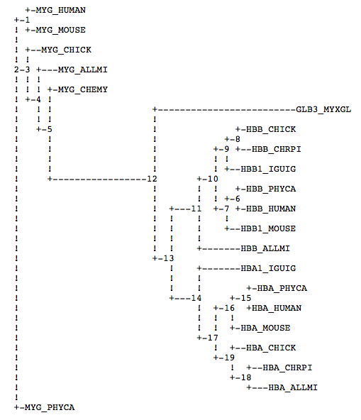

## Projects

  - [Follow up practical work on EM](media/EM-MAD.html)  
  - [Projet 2022 Kmeans++ ](media/Projet-MAD-2022.pdf) 
  - [Projet 2023 Generalized Kmeans ](media/Projet-MAD-2023.pdf)

## Lectures Notes

  - [Lecture 1 & 2](media/cours01-ENSIEE.pdf)  
  - [Lecture 3](media/cours02-ENSIEE.pdf)  
  - [Lecture 4](media/Algorithme-EM.pdf)  
  - [Lecture 5](media/cours03-ENSIEE.pdf)  
  - [Lecture 6](media/cours04-PCA.pdf)
  - [Lecture 7](media/cours05-KPCA.pdf)  

## Exercices

  - [Exercices on multivariate normal](media/TD-multivariate.pdf)
  - [Exercices on multivariate normal correction](media/TD-01-ENSIEE-correction.pdf)
  - [Exercices on clustering](media/TD-clustering.pdf)
  - [Exercices on mixture models](media/TD-mixture.pdf)
  - [Exercices on PCA](media/TD-ACP.pdf)
  - [Exercices on Kernels](media/TD-KPCA.pdf)

## Data files

  - [Globines distances](media/neighbor_globin.dat)
  - [Globines List](media/Globines_liste.txt)

## Document and Links

### Reference books about machine learning

  - [Machine Learning: A Probabilistic Perspective
](http://noiselab.ucsd.edu/ECE228/Murphy_Machine_Learning.pdf) from Kevin P. Murphy
    - Chapter 4: Gaussians models
    - Chapter 11: Mixture Models and EM algo (with kmeans)
    - Chapter 25: Clustering (HAC)
    - Chapter 12: Latent Linear Models (PCA)
    - Chapter 14: Kernels 
    
  - [Pattern Recognition and Machine Learning](http://users.isr.ist.utl.pt/~wurmd/Livros/school/Bishop%20-%20Pattern%20Recognition%20And%20Machine%20Learning%20-%20Springer%20%202006.pdf) from  Chris M Bishop 

### R base

Official manuals about R base can be retrieved from 

https://cran.r-project.org/manuals.html

Contribution by the community can be retrieved from

https://cran.r-project.org/other-docs.html

The short introduction from Emmanuel Paradis allows a quick start

   - [''R for Beginners''](https://cran.r-project.org/doc/contrib/Paradis-rdebuts_en.pdf) by Emmanuel Paradis.

Longer book allow a deepening. See for example

  - [''Using R for Data Analysis and Graphics - Introduction, Examples and Commentary''](https://cran.r-project.org/doc/contrib/usingR.pdf) by John Maindonald.

### R from RStudio developers

  -  [R for Data Science](https://r4ds.had.co.nz/)   The book of Wickam about more recent R development for data science 

And if you want more see https://www.rstudio.com/resources/books/

